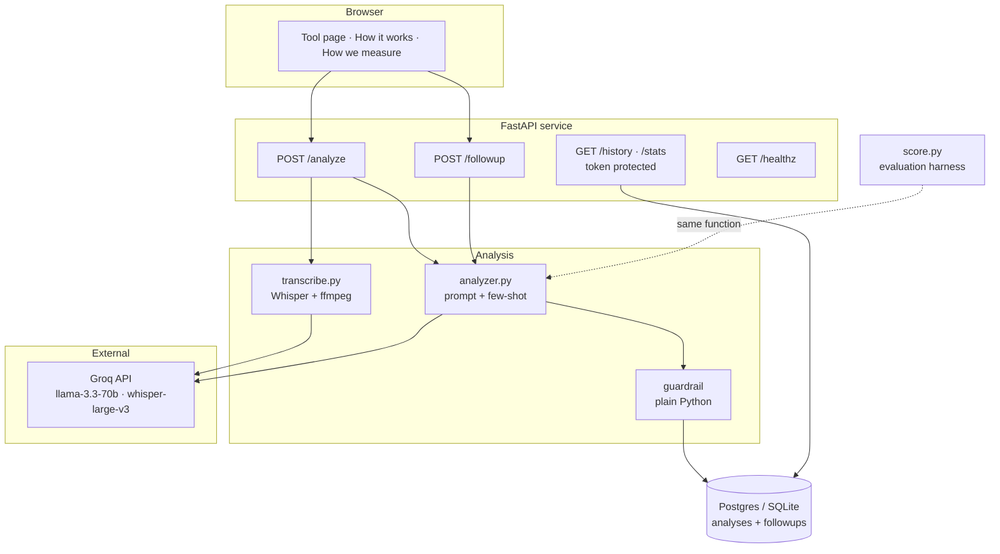
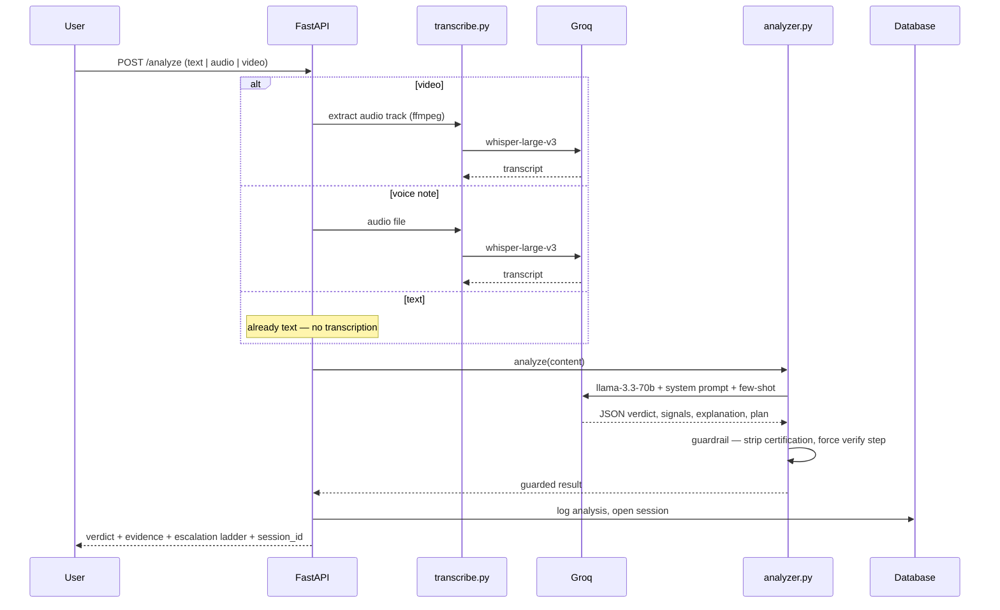
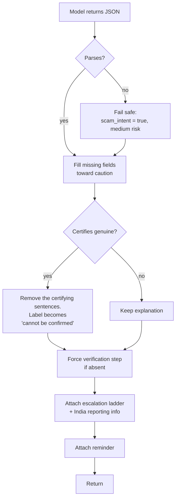
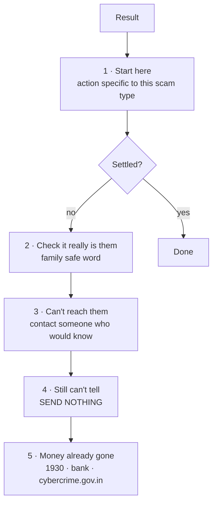
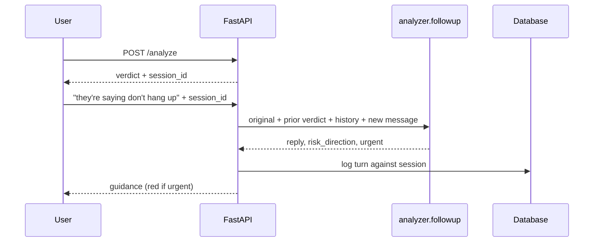
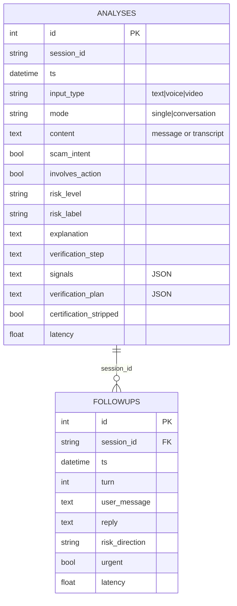

# DESIGN — Check First

How the system is put together, and why each decision was made rather than the
obvious alternative.

**Contents**
1. [The constraint everything follows from](#1-the-constraint-everything-follows-from)
2. [System architecture](#2-system-architecture)
3. [Request lifecycle](#3-request-lifecycle)
4. [The analysis engine](#4-the-analysis-engine)
5. [The guardrail](#5-the-guardrail)
6. [The escalation ladder](#6-the-escalation-ladder)
7. [Live follow-up](#7-live-follow-up)
8. [Data model](#8-data-model)
9. [Evaluation harness](#9-evaluation-harness)
10. [Deployment](#10-deployment)
11. [Rejected designs](#11-rejected-designs)

---

## 1. The constraint everything follows from

Deepfake detectors generalise badly. They score well on the generators they were
trained against and drop 10–15 points on real-world content, with no meaningful
zero-shot performance against generators they have not seen. Each new generator
resets them to blind.

A consumer safety product built on that will, sooner or later, tell a frightened
parent that a scam is authentic.

**So this system has no authenticity verdict.** Not disabled, not defaulted off —
absent from the output schema. It cannot express the claim.

What it does instead is judge **scam intent from content**: the manipulation applied
to the reader, not the provenance of the media. That signal survives transcription,
works identically across text, audio and video, and does not degrade when a new
generator ships.

### The asymmetry

| Error | Cost to the user |
|---|---|
| False alarm on a real message | One phone call |
| False reassurance on a scam | Everything they send |

Every threshold in this system is set knowing those are not equal. It fails toward
caution by construction — see [§5](#5-the-guardrail).

---

## 2. System architecture

The dotted line matters more than any solid one: **`score.py` calls the same
`analyzer.analyze()` that `/analyze` calls.** There is no parallel evaluation path, so
a measured number always describes shipped behaviour.

---

## 3. Request lifecycle

Three input types converge on one reasoning engine, because everything becomes text
before analysis.

**Why transcription rather than media forensics.** What harms a family is not a
synthesis artefact in a waveform — it is being pressured into sending money. That
pressure lives in the words and survives transcription intact. Analysing content also
means one engine serves all three inputs instead of three separate detectors, and it
does not decay when generators improve.

**Why video reduces to its audio.** A deepfake video's manipulation is in what is
being *said*. Frame-level detection would be the arms race described in
[§1](#1-the-constraint-everything-follows-from); extracting the audio track reuses a
pipeline already proven on voice notes.

---

## 4. The analysis engine

`analyzer.py` holds one system prompt, three few-shot examples, and an output contract.

### Signals

| Signal | Requires |
|---|---|
| secrecy demand | explicit instruction to hide it |
| blocking verification | discouragement from checking — "don't call back", "don't disconnect" |
| unusual payment route | a **new, unknown or changed** destination: gift cards, crypto, an unfamiliar UPI/account, "our details have changed" |
| impersonated authority | claim to be a bank, police, government, courier or tech support |
| credential request | asked to share or forward an OTP, code, PIN or password |
| threats or fear | account freeze, legal action, arrest, public shaming |
| suspicious link | unfamiliar or lookalike domain |
| urgency pressure | pushed to act immediately |

### Two rules that took three iterations to get right

**Signal discipline.** Every listed signal must quote the exact words that evidence it.
Inference is forbidden — no "implied", no "potentially". This exists because the Day 2
build fabricated evidence, reporting *"credential request implied"* on a message that
never mentioned a code. Confident-sounding invented evidence is worse than a wrong
verdict: it destroys the explanation, which is the product.

**The verdict bar.** Urgency plus a money request is **not** sufficient. A scam verdict
requires at least one genuine red flag beyond urgency. Real people write *"mom i need
5000 rn"* under stress, and a tool that flags every worried message is a tool families
learn to ignore — at which point it is worse than nothing.

**Why not a narrower payment rule.** An early revision defined "unusual payment route"
loosely and flagged *"UPI me on my usual number"* — the word "usual" being precisely
what made it ordinary. The definition now enumerates what counts as unusual, and
explicitly states that a transfer to a person's own known account is not.

---

## 5. The guardrail

The non-negotiable is enforced in Python, not requested in a prompt.

### Detecting certification

A fixed phrase list is not enough. The model writes *"appears to be a genuine birthday
wish"* — words in between defeat exact matching. `certifies_genuine()` instead matches
a **pattern**: an appearance or linking verb followed within a few words by a
genuineness word.

Two refinements were needed:

**Negation awareness.** The product's own disclaimer contains the sentence *"this tool
never confirms a message is genuine"*. Matching on the word alone flagged our own
safety text. The check now looks backwards from each match for a negator.

**Per-field, per-clause.** Fields were originally concatenated before checking, so the
word "no" in the risk label (*"no clear scam signals"*) sat 34 characters before a real
certification in the explanation and suppressed it. Negation now cannot leak across
field or clause boundaries.

### Removal, not prefixing

The first implementation prefixed a warning and left the certifying sentence in place —
so the user still read *"this appears to be a genuine birthday wish"*, with a
disclaimer above it. The guardrail now **excises** the offending sentences and keeps
the rest.

There is also no `genuine`, `authentic` or `safe` field anywhere in the schema.
Certification is not blocked; it is inexpressible.

---

## 6. The escalation ladder

A single instruction fails the moment it does not work. *"Call your son back"* is
useless advice when his phone is off — which is exactly when a frightened parent needs
the tool most.

**Rung 1 is scam-type specific.** A bank scam routes to the number on the back of the
card; a police impersonation routes to 112, with the plain statement that no Indian
force conducts arrests by phone; a courier scam routes to the official app, never the
link.

**Rung 4 is the philosophical keystone.** Being unable to verify is not a reason to
proceed — it is the strongest warning available. The manufactured hurry exists
precisely to outrun verification.

**Reporting information is a code constant**, never model-generated. A hallucinated
helpline number in a safety tool could route a panicking person to a second scammer.
The model writes the reasoning; Python supplies facts that must not be wrong.

**Ladder depth is keyed to stakes, not suspicion.** `involves_action` is true whenever
money, a code, or any irreversible step is involved — regardless of the verdict. A
birthday greeting gets one calm option. A money request gets the full ladder even when
it looks entirely ordinary, because the verdict can be wrong and the recovery path must
stay reachable.

---

## 7. Live follow-up

The most common real situation is not "I received a message" but "I am on the call
right now."

Guided buttons handle the common paths and cost **zero API calls** — every ladder rung
is already present in the first response, so tapping one cannot fail mid-demo or
mid-crisis. The free-text box handles everything else.

The follow-up prompt carries hard rules of its own: never certify, never instruct
anyone to share a code, never tell a user to **search online for an official number**
(scammers buy search placement for fake helplines — searching is how people reach a
second scammer), and never end on "I don't have that information" without giving an
action that works anywhere.

---

## 8. Data model

**Why `session_id` rather than a foreign key to `analyses.id`.** The session is minted
when the analysis is logged and returned to the client, which then attaches it to
follow-up turns. A string session survives the client round-trip without exposing
internal row IDs.

**Why `certification_stripped` is stored.** It records how often the model attempted to
certify a message as real and the guardrail intervened — an operational measure of how
hard the constraint is working, not just an assertion that it exists.

**Why SQLAlchemy over raw drivers.** One code path serves SQLite locally and Postgres in
production. Render's free tier has an ephemeral filesystem, so a SQLite file is erased
on every restart — the audit trail would silently vanish in production. Switching is a
connection string, not a rewrite.

---

## 9. Evaluation harness

`score.py` — see [KPI_SCOREBOARD.md](KPI_SCOREBOARD.md) for results and
[TESTING.md](TESTING.md) for method.

Four properties matter:

**Same engine.** Imports `analyzer.analyze()` directly. A separate evaluation path
could drift from production; this one cannot.

**Prompt-fingerprinted cache.** Per-case results are cached against a hash of the exact
prompt, few-shot text and model name. Editing the prompt invalidates the cache
automatically, making it impossible to report a stale number beside a fresh one.

**Rate-limit aware.** The free tier allows 12,000 tokens per minute; a ~2,500-token
prompt permits roughly four calls per minute. The harness measures each call's actual
cost and paces itself, because throttled calls would otherwise inflate measured latency
from ~1.1s to ~12s and corrupt a KPI.

**Resumable.** A rate limit mid-run saves progress and resumes, rather than discarding
an expensive partial run.

---

## 10. Deployment

| Concern | Choice | Why |
|---|---|---|
| Host | Render free tier | Free; auto-deploys on push |
| Database | Supabase Postgres | Render's disk is ephemeral — SQLite would be wiped on restart |
| Region | Singapore / Mumbai | Nearest to users |
| Secrets | Environment variables | Never committed; `.gitignore` covers the local database and caches |
| Admin endpoints | `ADMIN_TOKEN` | `/history` holds users' actual messages |

**Supabase Data API disabled.** The auto-generated REST layer would expose the
`analyses` table — containing users' private messages — over HTTP. The backend connects
directly via Postgres, so that surface is unnecessary and was removed.

**Endpoints fail closed.** If `ADMIN_TOKEN` is unset, `/history` and `/stats` return
404 rather than defaulting to open. A missing configuration must not silently expose
private data.

---

## 11. Rejected designs

**Fine-tuning.** Needs a large labelled training set; the 50 cases available are the
*test* set and training on them destroys the ability to measure. It also bakes today's
scam patterns into weights while patterns shift weekly, and replaces an inspectable
prompt with an opaque model — abandoning the explainability that is the product.

**RAG over a scam knowledge base.** Considered and rejected. There is no authoritative
ground-truth corpus for "is this specific message a scam", the base model already knows
common patterns unprompted, and an unvalidated knowledge base injects noise into a
safety tool. The narrow case where it *would* earn its place — a curated, cited feed of
emerging patterns from RBI and cybercrime advisories, as context and never as verdict —
could not be validated inside the sprint.

**Local Whisper (faster-whisper).** Better for privacy: audio never leaves the device.
Rejected for this build because Render's free tier cannot host it, so a hosted model
would have been needed for production anyway — meaning two models, tuned twice, with
measurement describing something other than what ships. On-device transcription is the
right production answer and remains a one-function change.

**Media forensics as a verdict.** Acoustic and visual artefact detection can be
reported as a *caution signal*, but never as authenticity, for the reasons in
[§1](#1-the-constraint-everything-follows-from). Load-bearing forensics would reintroduce
exactly the failure mode the product exists to avoid.

**A separate "conversation" input tab.** Built, then removed. Nobody has a conversation
sitting in their clipboard — they have a call recording (voice), forwarded messages
(text), or a call in progress. Long transcripts are now auto-routed to
conversation-aware analysis, and the live situation is handled by
[§7](#7-live-follow-up).
