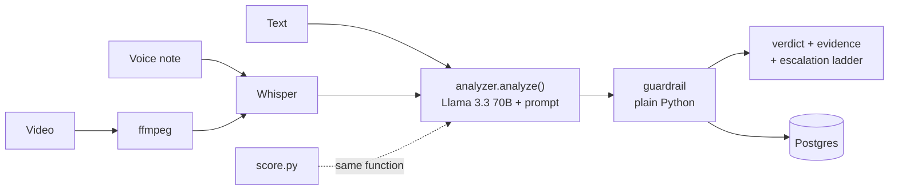

# Check First

**A scam and manipulation shield for families — that never tells you a message is genuine.**

Live: https://check-first-iomg.onrender.com

Paste a suspicious message, or upload a voice note or a video. Check First names the
manipulation being used, explains it in plain language, and gives a concrete way to
verify with a real human. It does not, and structurally cannot, certify anything as
authentic.

---

## Why it refuses to say "genuine"

Deepfake detectors score well on the fakes they were trained on and poorly on new
ones — a 10–15% real-world drop, with no meaningful zero-shot generalisation against
generators they have not seen. Every new generator makes them blind again.

A product built on that foundation will eventually tell a frightened parent that a
scam is genuine. So this one is not built on it.

**The asymmetry that drives every design decision:** a false alarm costs one phone
call. A false reassurance costs everything the user sends. Those are not equal, so
the system fails toward caution by construction, not by configuration.

Instead of detection, Check First reads the **manipulation in the content** — urgency,
secrecy, unusual payment routes, impersonated authority, credential requests, anything
designed to stop you verifying — and always hands back a way to check independently.
That approach keeps working when the next generator arrives, because it never depended
on detection.

---

## What it does

| | |
|---|---|
| **Three inputs, one pipeline** | Text, voice notes and video. Audio is transcribed; video has its audio track extracted and transcribed. Everything becomes text, so one reasoning engine serves all three. |
| **Signals with evidence** | Every signal must quote the exact words that show it. The model is forbidden from inferring a signal that is not literally present. |
| **A plain-language explanation** | Two or three sentences, no scores, no jargon. |
| **An escalation ladder** | Not one instruction — a sequence: what to do first, how to confirm identity, what to do if they are unreachable, what to do when verification is impossible, and what to do if money has already gone. |
| **India-specific reporting** | 1930 (cyber fraud), 112 (police), cybercrime.gov.in. Hard-coded in the application, never generated by the model. |
| **Live follow-up** | The situation is often still unfolding. Users can describe what is happening turn by turn and get guidance that carries the original assessment as context. |
| **Family safe word** | The product teaches families to agree one, then references it as the identity check in every escalation ladder. |

---

## Results

Measured on two sets. Both are in this repository.

| Set | Cases | Result |
|---|---|---|
| **Committed** (`testset.csv`) | 40 — 20 scam, 20 legitimate | **100%** |
| **Adversarial** (`adversarial_set.csv`) | 20, written to break the system | **70%** |

The committed set was written and locked into version control **before any tuning**,
so its labels could not be adjusted to flatter the result.

Scoring 100% means a test set has stopped teaching you anything, which is why the
adversarial set exists. It contains real fraud patterns collected from people who
receive these calls, plus deliberate attacks on the system's own assumptions —
terseness, Hinglish, legitimate messages carrying scam signals, and scams carrying
none. It is expected to score lower. That is its job.

Full KPI table, the six failing cases, and what they mean: **[KPI_SCOREBOARD.md](KPI_SCOREBOARD.md)**
and the live page at [`/measure`](https://check-first-iomg.onrender.com/measure).
How the sets were built and how to rerun them: **[TESTING.md](TESTING.md)**.

---

## Running it

**Requirements:** Python 3.11+, `ffmpeg` on PATH (video only), a free
[Groq](https://console.groq.com) API key.

```bash
git clone https://github.com/Suhani-99/check-first.git
cd check-first
pip install -r requirements.txt

export GROQ_API_KEY="gsk_..."        # PowerShell: $env:GROQ_API_KEY="gsk_..."
uvicorn app:app --reload
```

Open http://127.0.0.1:8000

With no `DATABASE_URL` set it uses a local SQLite file. Set one and it uses Postgres —
no code changes.

### Environment variables

| Variable | Required | Purpose |
|---|---|---|
| `GROQ_API_KEY` | yes | Analysis and transcription |
| `DATABASE_URL` | no | Postgres connection string. Falls back to SQLite. |
| `ADMIN_TOKEN` | no | Protects `/history` and `/stats`. **If unset, those endpoints return 404** — they fail closed rather than exposing user messages. |

---

## Reproducing the results

```bash
python score.py                      # committed set  -> 100%
python score.py adversarial_set.csv  # adversarial set -> 70%
python check_limits.py               # shows remaining API rate-limit budget
```

Both scripts call the **same `analyzer.analyze()` the live site calls** — not a test
copy — so the measured number describes the deployed behaviour. Results are cached per
case and the cache is fingerprinted to the exact prompt: change the prompt and the
cache invalidates, so a stale result can never be reported as a current one.

---

## How it is built



The dotted line is the important one: the evaluation harness calls the same function
production calls, so a measured number always describes shipped behaviour.

### Project structure

```
.
├── README.md               ← you are here
├── DESIGN.md               ← architecture, diagrams, and every rejected alternative
├── TESTING.md              ← how the test sets were built and how to rerun them
├── KPI_SCOREBOARD.md       ← target vs actual, and the six cases it gets wrong
│
├── app.py                  ← FastAPI: pages, /analyze, /followup, /history, /healthz
├── analyzer.py             ← the engine: prompt, few-shot, guardrail, follow-up
├── transcribe.py           ← Whisper transcription; ffmpeg audio extraction
├── db.py                   ← SQLAlchemy: SQLite locally, Postgres in production
│
├── score.py                ← evaluation harness (paced, resumable, cache-fingerprinted)
├── check_limits.py         ← shows which Groq rate limit is currently binding
├── build_adversarial.py    ← regenerates adversarial_set.csv
├── spike.py                ← day-1 throwaway: proved the core idea in 30 minutes
│
├── testset.csv             ← 40 committed cases — locked before any tuning
├── adversarial_set.csv     ← 20 cases written to break the system
│
├── audio/                  ← voice cases: real recordings + synthetic scam speech
├── video/                  ← video cases: normal clips + audio-swapped manipulations
└── static/
    ├── index.html          ← the tool
    ├── how.html            ← How it works — the trust document
    ├── measure.html        ← How we measure — numbers, publicly
    └── style.css           ← colour is reserved exclusively for risk
```

| File | Responsibility |
|---|---|
| `app.py` | FastAPI service. Pages, `/analyze`, `/followup`, token-protected `/history` and `/stats`, public `/healthz`. |
| `analyzer.py` | The engine. Prompt, few-shot examples, escalation ladder, guardrail, live follow-up. |
| `transcribe.py` | Whisper transcription; ffmpeg audio extraction for video. |
| `db.py` | SQLAlchemy layer. Sessions link an analysis to its follow-up turns. |
| `score.py` | Evaluation harness. Rate-limit aware, resumable, prompt-fingerprinted cache. |

**Stack:** FastAPI · Groq (`llama-3.3-70b-versatile`, `whisper-large-v3`) ·
SQLAlchemy · Postgres (Supabase) · Render.

No model was fine-tuned. The system is prompt-engineered with few-shot examples,
deliberately: a prompt is inspectable and correctable in seconds, where a fine-tuned
model is opaque and stale the moment scam patterns shift. The architecture is
model-agnostic — swapping the LLM is a one-line change. Full rationale, and the
alternatives that were rejected, in [DESIGN.md](DESIGN.md#11-rejected-designs).

---

## The guardrail

"Never certify a message as genuine" is enforced in **code**, not requested in a prompt.

`analyzer.certifies_genuine()` pattern-matches affirmative certification —
appearance verbs followed by genuineness words — while excluding negated forms, so the
product's own disclaimer ("this tool never confirms a message is genuine") is not
flagged while an actual claim is. When one is found the offending sentence is
**removed**, not merely prefixed with a warning, and the verdict is replaced with
*"cannot be confirmed — verify with a human."*

The guardrail also guarantees a verification step on 100% of results, and defaults
every missing field toward caution. There is no `genuine` field anywhere in the output
schema — certification is structurally impossible, not disabled.

---

## Known limits

Stated plainly because a safety tool that hides its failure modes is asking for trust
it has not earned.

**It reads one message at a time.** The dominant fraud pattern today is conversational:
a caller opens with details bought from a data leak, builds rapport across several
turns, and asks for money only at the end. Judged alone, that opening message has no
red flags — because there are none yet. The follow-up mode partially addresses this;
full conversational analysis is the next thing to build.

**Its signals are neither necessary nor sufficient.** A legitimate message can carry
every red flag (a real emergency, calling from a stranger's phone, needing money sent
to an unfamiliar account). A real scam can carry none. This is not a tuning problem —
it is the limit of judging one message by its contents, and it is precisely why the
product hands over a verification step instead of a verdict.

**It cannot recover money already sent**, cannot see a message that has not reached the
user, and depends on transcription quality for audio.

**It treats every request to share an OTP as a red flag**, including the rare
legitimate ones. That is deliberate. A rule with exceptions is a rule a scammer can
talk someone through.

---

## Test material

All evaluation material was created for this project. Scam and legitimate messages
were written by hand; legitimate voice notes are real recordings; scam voice notes are
synthetic speech, which is an accurate threat model — a real attacker clones the
relative's voice, not the user's. Manipulated video was produced by replacing a clip's
audio track with synthetic scam speech.

No real person was contacted, and no third-party or gated dataset was used.

---

## Documentation

| Document | What it covers |
|---|---|
| [DESIGN.md](DESIGN.md) | Architecture, request lifecycle, guardrail internals, data model, and every design that was rejected and why |
| [TESTING.md](TESTING.md) | How both test sets were built, how to reproduce every number, and what is *not* covered by automated tests |
| [KPI_SCOREBOARD.md](KPI_SCOREBOARD.md) | Target vs actual for every KPI, how each was measured, and a written analysis of all six failing cases |
